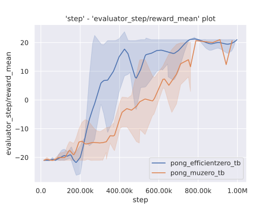

# DI-toolkit

[](https://pypi.org/project/DI-toolkit/)


[](https://github.com/opendilab/DI-toolkit/actions?query=workflow%3A%22Docs+Deploy%22)
[](https://github.com/opendilab/DI-toolkit/actions?query=workflow%3A%22Code+Test%22)
[](https://github.com/opendilab/DI-toolkit/actions?query=workflow%3A%22Badge+Creation%22)
[](https://github.com/opendilab/DI-toolkit/actions?query=workflow%3A%22Package+Release%22)
[](https://codecov.io/gh/opendilab/DI-toolkit)

[](https://github.com/opendilab/DI-toolkit/stargazers)
[](https://github.com/opendilab/DI-toolkit/network)

[](https://github.com/opendilab/DI-toolkit/issues)
[](https://github.com/opendilab/DI-toolkit/pulls)
[](https://github.com/opendilab/DI-toolkit/graphs/contributors)
[](https://github.com/opendilab/DI-toolkit/blob/master/LICENSE)

A simple toolkit package for opendilab, including the following utilities:

- `ditk.logging`, a easy-to-use logger system
- `ditk.annonated`, an annotated documentation generation script
- `ditk.tensorboard`, a utility for extract data from tensorboard log file
    - `ditk.tensorboard.plot`, plot utilities for plotting data extracted from tensorboard log file

## Installation

You can simply install it with `pip` command line from the official PyPI site.

```shell
pip install DI-toolkit
```

Or installing from the latest source code as follows:

```shell
git clone https://github.com/opendilab/DI-toolkit.git
cd di-toolkit
pip install . --user
```

## Quick Start

### Example of ditk.logging

Here is an example of logging.

```python
from ditk import logging

if __name__ == '__main__':
    logging.try_init_root(logging.INFO)
    logging.info('This is info')
    logging.warning('This is warning with integer 233')
    logging.error('This is a error with string \'233\'.')

    try:
        _ = 1 / 0
    except ZeroDivisionError as err:
        logging.exception(err)

```

`ditk.logging`has almost the same interface as native `logging` module. You can directly replace `import logging` in the
code with `from ditk import logging`.

### ditk.annonated

Python annotated documentation generation script like the following


#### Usage

```shell
python -m ditk.doc.annotated create -i ditk/doc/annotated/ppo.py -o my_doc/index.html -L zh
```

You will get

```text
my_doc
├── assets
│   ├── pylit.css
│   └── solarized.css
└── index.html
```

#### Help Information

* `python -m ditk.doc.annotated --help`

```text
Usage: python -m ditk.doc.annotated [OPTIONS] COMMAND [ARGS]...

  Utils for creating annotation documentation.

Options:
  -v, --version  Show version information.
  -h, --help     Show this message and exit.

Commands:
  create  Utils for creating annotation documentation from local code.
```

* `python -m ditk.doc.annotated create --help`

```text
Usage: python -m ditk.doc.annotated create [OPTIONS]

  Utils for creating annotation documentation from local code.

Options:
  -i, --input_file FILE       Input source code.  [required]
  -o, --output_file FILE      Output annotated documentation code.  [required]
  -A, --assets_dir DIRECTORY  Directory for assets file of this documentation.
  -L, --language [zh|en]      Language for documentation.  [default: en]
  -T, --title TEXT            Title of the documentation.  [default: <Untitled
                              Documentation>]
  -h, --help                  Show this message and exit.
```

#### Related Library

- [KaTex](https://github.com/KaTeX/KaTeX)
- [codemirror5](https://github.com/codemirror/codemirror5)
- [yattag](https://www.yattag.org/)

### Create Multi-Seed Multi-Algorithm Benchmark Plots

```python
import matplotlib.pyplot as plt
import seaborn as sns

from ditk.tensorboard.plots import tb_create_range_plots

sns.set()

tb_create_range_plots(
    'test/testfile/pong_tb',  # directory of tensorboard log
    xname='step',
    yname='evaluator_step/reward_mean',
)

plt.show()
```



## Contributing

We appreciate all contributions to improve `DI-toolkit`, both logic and system designs. Please refer to CONTRIBUTING.md
for more guides.

## License

`DI-toolkit` released under the Apache 2.0 license.
