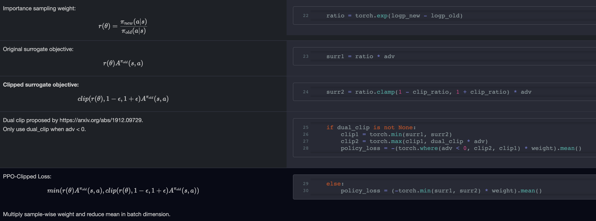

# Annonated "Algorithm-Code" Documation

Python Annonated Documation Generation Script

# Demo

<div align="center">
    <a href="https://github.com/opendilab/DI-toolkit"></a>
</div>

# Usage

```shell
python -m ditk.doc.annotated create -i ditk/doc/annotated/ppo.py -o my_doc/index.html -L zh
```

You will get

```text
my_doc
├── assets
│   ├── pylit.css
│   └── solarized.css
└── index.html
```

# Help Information

* `python -m ditk.doc.annotated --help`

```text
Usage: python -m ditk.doc.annotated [OPTIONS] COMMAND [ARGS]...

  Utils for creating annotation documentation.

Options:
  -v, --version  Show version information.
  -h, --help     Show this message and exit.

Commands:
  create  Utils for creating annotation documentation from local code.
```

* `python -m ditk.doc.annotated create --help`

```text
Usage: python -m ditk.doc.annotated create [OPTIONS]

  Utils for creating annotation documentation from local code.

Options:
  -i, --input_file FILE       Input source code.  [required]
  -o, --output_file FILE      Output annotated documentation code.  [required]
  -A, --assets_dir DIRECTORY  Directory for assets file of this documentation.
  -L, --language [zh|en]      Language for documentation.  [default: en]
  -T, --title TEXT            Title of the documentation.  [default: <Untitled
                              Documentation>]
  -h, --help                  Show this message and exit.
```

# Related Library

- [KaTex](https://github.com/KaTeX/KaTeX)
- [codemirror5](https://github.com/codemirror/codemirror5)
- [yattag](https://www.yattag.org/)
